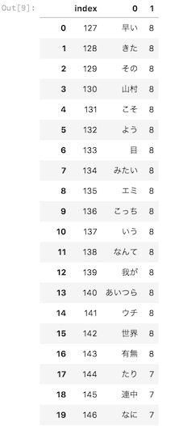

## 使い道
WordCloudの時に(単語, 頻度数)という２つのカラム構成されているときに、そのままではWordCloudにかませることができない。  
それを解消するツールである。  

### 変換すべきCSVの例

## 使い方
  
```sample.py
from wc_csv import convert_wc_csv

wcsv = convert_wc_csv.Wcsv()
# どれくらいの頻度の単語を指定するか指定
df = wcsv.missing_value('sample.csv',8)
text = wcsv.convert_string(df)
```
  

## インストール方法

```
pip install wc_csv
```
  
## オプション

```sample2.py
from wc_csv import convert_wc_csv

wcsv = convert_wc_csv.Wcsv()
# どれくらいの頻度の単語を指定するか指定
df = wcsv.missing_value('sample.csv',8)
array = wcsv.convert_string(df, option=True)
```

上でテキストだけではなく配列で受け取ることも可能。  
gensimのLdaModelなどでも利用することができる。
